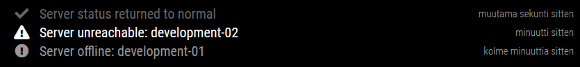

# MMM-InfluxDB2Notifications

A [MagicMirror²](https://github.com/MichMich/MagicMirror) module to display [InfluxDB v2](https://docs.influxdata.com/influxdb) alert notifications. Notifications are sent to the module using a simple HTTP POST call.

Modified from [MMM-HomeAutomationNotifications](https://github.com/john3300/MMM-HomeAutomationNotifications).

## Screenshots



## Installation

1. Navigate into your `MagicMirror/modules` directory and execute `git clone https://github.com/sipuli93/MMM-InfluxDB2Notifications.git`

## Using the module

To use this module, add it to the modules array in the `config/config.js` file:
``` js
modules: [
    {
        module: "MMM-InfluxDB2Notifications",
        position: "bottom_bar",	// This can be any of the regions.
        config: {
            // The config property is optional.
            // See 'Configuration options' for more information.
        }
    }
]
```

You will also need to ensure that your global configuration entry for `address` is set to listen on the correct interface. The `ipWhiteList` should also contain the IP address of your InfluxDB server that will be sending the requests. Without both of these items MagicMirror will refuse the requests.

Notification endpoint for InfluxDB v2:
`http://<SERVER-ADDRESS>:<PORT>/MMM-InfluxDB2Notifications`

Module uses alerts `_level` field value for notification type: ok, warn, crit. Font and icon for these are editable.

Module uses alerts `_message` field value for the message.

More about setting up InfluxDB v2 alerts can be found from [InfluxDB Docs](https://docs.influxdata.com/influxdb/v2.1/monitor-alert/).

The server can be tested with example POST request:
`curl --header "Content-Type: application/json" --request POST --data '{"_level":"warn","_message":"This is test warning!"}' http://<SERVER-ADDRESS>:<PORT>/MMM-InfluxDB2Notifications`

## Configuration options

The following properties can be configured:
|Option|Description|
|--|--|
|`max`|The maximum number of notifications to display.<br/><br/>**Default value:** `5`|
|`duration`|How long each notification should be displayed. (Minutes)<br/><br/>**Default value:** `30`|
|`animationSpeed`|Speed of the update animation. (Milliseconds)<br/><br/>**Possible values:** `0` - `5000`<br/>**Default value:** `2500` (2.5 seconds)|

